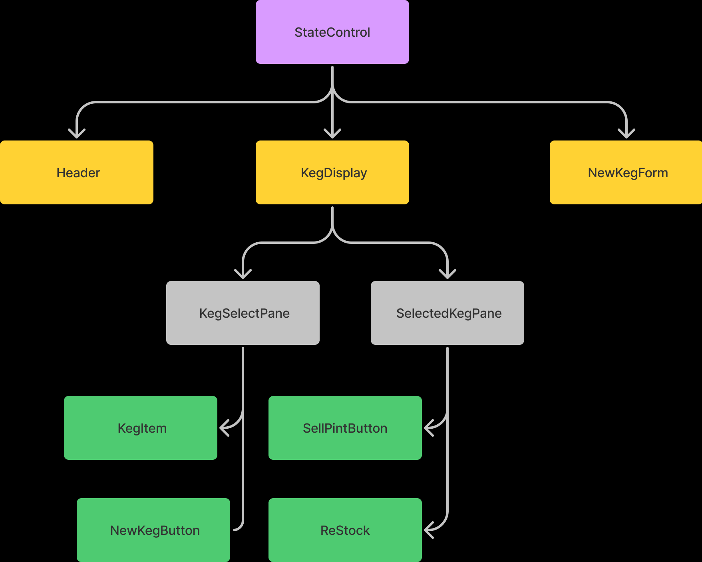

# _Tap Room_

#### By _**Jacob Wilson**_

#### _An application to help a user manage beers on tap in a bar._

## Technologies Used

* _React_
* _JavaScript_
* _JSX_
* _HTML_
* _CSS_
* _React-Bootstrap_

## Description

_A react application designed to help the user manage kegs on tap in an establishment. The app has create and read functionality and while the app doesn't have delete functionality the keg will delete when empty._

## Setup/Installation Requirements

* _You can find the github repository [here](https://github.com/JLEWilson/tap-room.git)_
* _Click the code button, and copy the https link_
* _In your in git bash or your preferred git terminal navigate to the directory you would like to store the project_
* _Enter: "git clone" followed by the https link_
* _Now that the repository is cloned to your computer, right click on the folder and click open with vs code_
* _Now type npm install in your terminal to install the packages used in the project, you may have to run install twice due to the size of the packages_
* _You can now view the project by typing npm run start in your terminal_
* _OR_
* _You can find the deployed project on gh-pages (here)[]_

## Known Bugs

* _No known bugs_

* _Not a bug but I would like to refactor to cut down on property drilling_

## License - [MIT](https://opensource.org/licenses/MIT)

_If you run into any problems or find a bug, would like to reach me for a separate reason, feel free to send me an email @jacobleeeugenewilson@gmail.com with details of your issue._

Copyright (c) _02/11/2022_ _Jacob Wilson(s)_